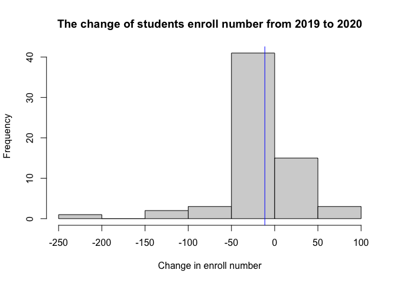
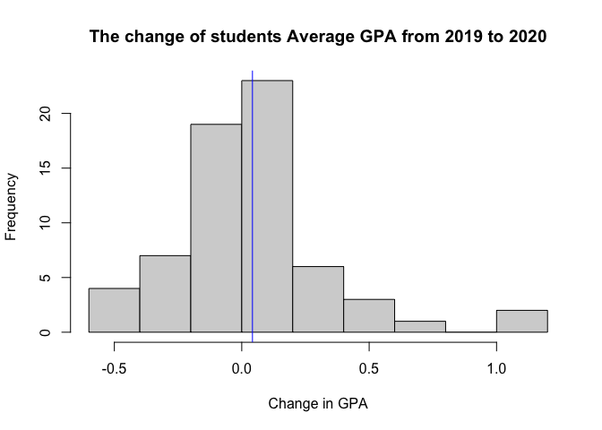
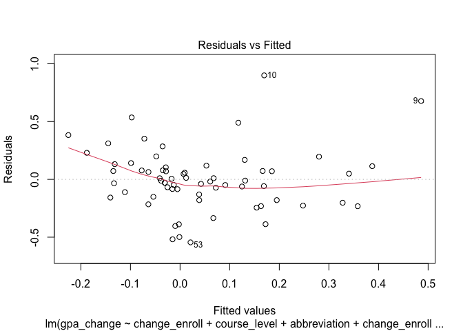
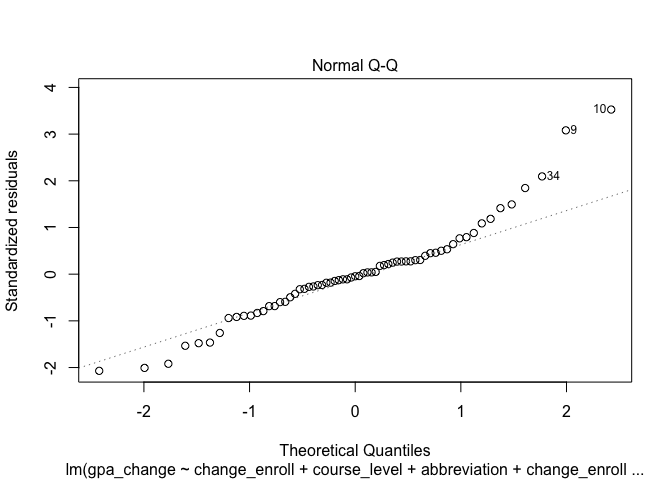

STAT340 Final Project
================
Wen Ye, Shihao Yang, Xin Bu
05/04/2021

## Introduction

Starting from the Spring Break in 2020, many institutions have turned to
online instructions due to the COVID pandemic. In this context, many
students feel that the overall GPA became higher. The main question we
want to answer in this report is: is it a real phenomenon that the
overall GPA is higher when classes are taught online rather than
in-person? Specifically, we will compare the term of Fall 2019 and Fall
2020 which are the last in-person term and the first online term,
respectively. We found this data interesting because it is a
comprehensive dataset from the Office of Registrar of our own
university. We can determine the specific letter grade count for any
class taught in the semesters we are examining and the average GPA for
each course as well as the average GPA for all courses of a specific
subject. With information about the room, we have facility code
corresponding to online and in-person instructions which allow us to
examine the difference between the same class taught in the online
environment and in-person instructions. The question we asked closely
relates to our friends and ourselves as well, especially since the
University just updated the grading policy of pass/fail.

## Thesis Statement

Since Covid-19 influence our life and study profoundly, we want to
explore if the online instruction has some potential influence on
students grade and GPA. Our thesis statement is that there is no big
difference in the average GPA of COMP SCI, STAT, and MATH courses for
the online term and in-person semester.

## Data

&lt;-We are interested in doing GPA-related analysis and found some data
from the [Office of Registrar](https://registrar.wisc.edu/datacenter/).
We used tools like
[madgrades-extractor](https://github.com/madgrades/madgrades-extractor)
to convert those data from PDFs to CSV file.

&lt;-Possibly, we want to see if it’s a real phenomenon that UW Madison
students’ GPAs are higher from online instructions. Or we might also
look into the difference between GPAs across different colleges and
majors in UW-Madison from 2019 spring to 2020 fall. Another idea we had
was to see if there are necessary relationships between the rating of
professors and the average GPA of their classes. Our data sources were
all placed in [github
repository](https://github.com/wen-ye-xwz/GPA-Analysis)

-   course\_offerings.csv provides each course’s name, id, and
    corresponding termcode.
-   courses.csv give us the number of each course offered in the past
    terms.
-   grade\_distributions.csv measures the count of letter grades for
    each course section.
-   instructors.csv give us a list of instructors name and their
    corresponding id number.
-   rooms.csv give us each course’s delivery method: whether it’s
    online, off-campus, or on-campus. And if it’s on-campus, there is a
    corresponding room id for that course.
-   schedules.csv provides us each course offering days in a week and
    its time duration.
-   sections.csv collected the courses’ uuid in course\_offering.csv,
    rooms.csv, and schedules.csv together to give us a bridge to connect
    different datasets.
-   subject\_memberships.csv provide each course’s subject code with its
    corresponding course\_offering\_uuid.
-   subjects.csv collects each subject’s name, abbreviation, and
    subject\_code.
-   teachings.csv give the instructor\_id for each section\_uuid
-   TermCode.csv collects each academic year and its corresponding
    termcode for Spring, Summer, and Fall terms in a year.

#### Data Processing:

To begin with, we combined the course\_offerings with the course dataset
by “course\_uuid” - the specific identifier for the course. With the new
data set, we conclude the grade distribution of each course. Each course
may open more than one section. To have more detailed course
information, we incorporated the section information into the dataset.
We then add the instruction information to the dataset by the identifier
“instructor\_id”. From the rooms.csv, we know the online course has a
specific room facility code. We examine the data to add an “isonline”
column, if a section of the course has the specific room facility code,
it is an online course. Afterward, we deleted the data rows without GPA
records. Finding that there are some duplicate data, we used the
distinct function to make each data row is a distinct section of one
course. We add the subject information to the data by combining the
subject\_memberships and subjects. In the end, to make the data easy to
understand, we use the select function to keep the significant
information such as course name, section number, section type, course
number, instructor name, GPA distribution, isonline as well as subject
information.

#### Figure

``` r
#if we control for instructor for the same class, do not get much data points but it's enough for analysis.
joined_all = full_join(online_all_2020,all_2019,by = c("course_name","course_number", "instructor_name","abbreviation"),suffix = c("_2020","_2019"))%>%
  mutate(change_enroll = students_2020-students_2019,
         gpa_change = gpa_2020-gpa_2019,
         course_level = floor(course_number/100))%>%
  drop_na()
hist(joined_all$change_enroll, main = "The change of students enroll number from 2019 to 2020", xlab = "Change in enroll number")
abline(v = mean(joined_all$change_enroll), col = "blue")
```

<!-- -->

``` r
hist((joined_all)$gpa_change, main = "The change of students Average GPA from 2019 to 2020", xlab = "Change in GPA")
abline(v = mean(joined_all$gpa_change), col = "blue")
```

<!-- -->

## Method & Result Interpretation

#### Hypothesis Testing

``` r
set.seed(123)
# take the gpa change from the data set which take instructor into consideration
gpa_change = unname(joined_all$gpa_change)
gpa_mu = mean(gpa_change)
gpa_sd = sd(gpa_change) 


# Sample from normal distribution
simulate_X = function(){
  return(mean(rnorm(n = length(gpa_change), mean = 0,sd = gpa_sd)))
}

# check whether the simulated mean is more extreme than what we observed
check_if_X_in_A = function(X){
  return(abs(X) >= abs(gpa_mu))
}
# simulation
r = 10000
monte_carlo = data.frame(replicate = 1:r, 
                         X = rep(NA,r), 
                         X_in_A = rep(NA, r)) 
for(i in 1:r){
  monte_carlo$X[i] = simulate_X()
  monte_carlo$X_in_A[i] = check_if_X_in_A(monte_carlo$X[i])
}

monte_carlo = as_tibble(monte_carlo)
monte_carlo %>% summarise(mean(X_in_A))
```

    ## # A tibble: 1 × 1
    ##   `mean(X_in_A)`
    ##            <dbl>
    ## 1          0.257

> Hypothesis testing is a common and reliable method to explore our
> assumption and Monte Carlo is an easy method to compute the p-value as
> well as draw the conclusion to the hypothesis testing. We first used
> hypothesis testing to test out null hypothesis that the average GPA
> for Fall 2020 did not change from the average GPA for Fall 2019, which
> means the difference in the two average GPAs is 0. The mean of GPA
> change equal to zero is the same to say the difference of the mean of
> GPA equal to zero. From the histogram of GPA change above, we see that
> it’s approximately a normal distribution. So, our model under the null
> hypothesis is that the change in GPA comes from a normal distribution
> with *μ* = 0 and *σ* = *σ*(*o**b**s**e**r**v**e**d**d**a**t**a*). We
> then used Monte Carlo simulation to repeat the situation to generate
> the sequence of GPA change that has the same length as the collected
> data. We count the number of times that the absolute value of the
> average GPA change simulated is as extreme as or more extreme as what
> we observed and compute the probability.

> Our p-value is 0.2568, which is much larger than the standard
> confidence level 0.05. So, we do not have enough evidence to reject
> the null hypothesis that the average of gpa change is 0. And this
> implies that the increase in GPA that we observed is highly likely
> just due to chance and that’s not enough to indicate a real underlying
> phenomenon.

#### Linear Regression

``` r
lr = lm(gpa_change ~ change_enroll+course_level+abbreviation+change_enroll, data = joined_all)
summary(lr)
```

    ## 
    ## Call:
    ## lm(formula = gpa_change ~ change_enroll + course_level + abbreviation + 
    ##     change_enroll, data = joined_all)
    ## 
    ## Residuals:
    ##      Min       1Q   Median       3Q      Max 
    ## -0.54487 -0.15072 -0.01185  0.10391  0.89929 
    ## 
    ## Coefficients:
    ##                    Estimate Std. Error t value Pr(>|t|)  
    ## (Intercept)       0.3037133  0.1143190   2.657   0.0101 *
    ## change_enroll    -0.0014641  0.0008513  -1.720   0.0906 .
    ## course_level     -0.0430988  0.0181849  -2.370   0.0210 *
    ## abbreviationMATH -0.0303171  0.0876908  -0.346   0.7308  
    ## abbreviationSTAT -0.1899588  0.0806345  -2.356   0.0218 *
    ## ---
    ## Signif. codes:  0 '***' 0.001 '**' 0.01 '*' 0.05 '.' 0.1 ' ' 1
    ## 
    ## Residual standard error: 0.2709 on 60 degrees of freedom
    ## Multiple R-squared:  0.2341, Adjusted R-squared:  0.183 
    ## F-statistic: 4.584 on 4 and 60 DF,  p-value: 0.002692

``` r
plot(lr, which = 1:2)
```

<!-- --><!-- -->

> We then used linear regression to see the relationship between the
> change in GPA with the enrollment number change, the course level, and
> the subject. This method is suitable because it’s straightforward to
> interpret the coefficients as relationships between variables. We
> ended up running the linear regression only on the variables itself
> because we tried adding the interaction terms and none of them are
> significant. From the residual plot, we do not see any evidence for
> non-linearity, so we did not include any polynomial terms. And the
> error terms in general follow a normal distribution.

> Looking at the coefficients of the predictors, we have three
> predictors that have significant p-values: the intercept, the
> course\_level and the STAT subject. Although these predictors have
> relatively small estimated coefficients, their standard errors are
> much smaller. The subject here is a categorical variabl.So, the linear
> regression chose COMP SCI as a baseline and created two dummy
> variables for MATH and STAT. The intercept shows that keeping
> everything else at 0, we should expect to see the average gpa to
> increase by 0.3 from Fall 2019 to Fall 2020 if the class is a COMP SCI
> class. If the class is a STAT class, we should expect the average GPA
> to increase by only (0.3037-0.1899) = 0.1178. If the class is a MATH
> class, we should expect the average GPA to increase by only
> (0.3037-0.0303) = 0.2774. If we only look at the course level and fix
> all the other predictors, then for every course level we jump up, we
> should expect the difference of average GPA from Fall 2019 to Fall
> 2020 for this class to decrease by 0.04. The fact that all the
> predictors have negative coefficients indicate that they will make the
> change in GPA even smaller.

## Conclusion

> As we’ve already discussed above, we can come to our final conclusion
> that **there is no big difference in the average GPA of COMP SCI,
> STAT, and MATH courses for the online term and in-person semester.**

> From our figures, we do see some minor increase of average GPA and
> some minor decrease of students enroll number occur from 2019 to 2020.
> However, In our hypothesis testing, our p-value is 0.2568, which is
> much larger than the standard confidence level of 0.05. So, we do not
> have enough evidence to reject the null hypothesis that the average
> GPA change is 0. And this implies that the increase in GPA that we
> observed is highly likely just due to chance and that’s not enough to
> indicate a real underlying phenomenon.

> In our linear regression model, we do find some correlations between
> gpa\_change and some other variables like the course\_level and the
> STAT subject which are very interesting to see. By having a
> significant intercept, that also implies that the COMP SCI subject is
> correlated with GPA change as well.

> Although our hypothesis testing showed an insignificant result. Our
> linear regression did show an intercept estimate that is significant.
> But we cannot take this as evidence of there being a meaningful
> increase in GPA change from Fall 2019 to Fall 2020 because the linear
> regression takes into account too few variables. And to be careful,
> the intercept represents the baseline subject (COMP SCI) change.

#### Limitation do exist in our project

> 1.  After we filter for the same courses with the same instructor
>     between 2019 and 2020. We got very little data points which are
>     able to use. But we believe the quality of the data is way more
>     important than quantity.

> 2.  We narrow down our analysis to just three subjects which we are
>     familiar with. Which means our project’s conclusion may not apply
>     to other subjects. Maybe we can do more analysis in the future
>     with different subjects to see if there is any exception from our
>     conclusion.
